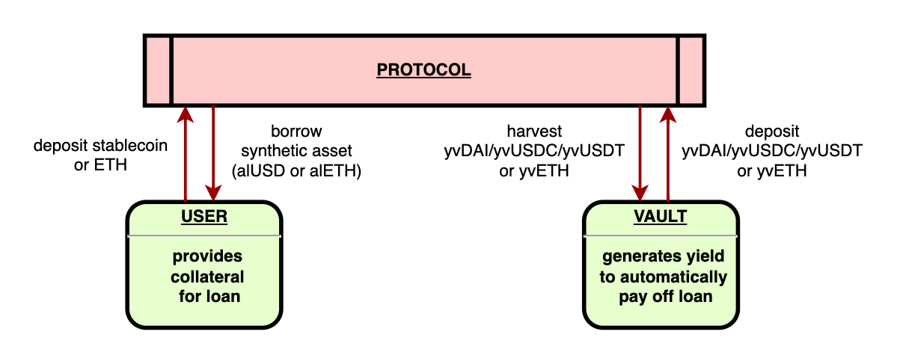

# Introducing Alchemix Finance

<!-- Proposed Meta description -->
<!-- Overview of Alchemix, ... -->

<!-- todo: watch SF episode on Alchemix: https://www.youtube.com/watch?v=GxAMpMzcgRI -->

> #### "Alchemix Self-Repaying Loans allow you to leverage a range of tokens without risk of liquidation."
>
> –Alchemix

## What is Alchemix?

[Alchemix Finance](https://alchemix.fi/) is a [future-yield-backed synthetic asset protocol and community DAO](<https://alchemix-finance.gitbook.io/alchemix-finance/>) that offers "self-paying, interest-free, non-liquidating loans".
The platform was launched in early 2021 by a team operating under the alias Scoopy Trooples and is currently in its v2 phase.

## How Does Alchemix Work?

As a deFi project, Alchemix allows users to collateralize loans by issuing synthetic assets (alAssets) in exchange for established US dollar-pegged stablecoins or ether (ETH), or their yield-bearing counterparts: yvDAI, yvUSDC, yvUSDT and yvETH.

Alchemix reroutes the user's deposited tokens to a secondary vault to earn yield, which the protocol periodically harvests to automatically pay off users' debt.
The protocol does so by crediting depositors' accounts with a proportional share of the accrued yield, thereby raising their available credit and decreasing amount owed over time.

## Alchemix Components

### Alchemist

`Alchemist`s can be considered the smart contract hub of the Alchemix protocol and behave similar to established lending platforms such as AAVE.
The main difference is that users are given synthetic "alchemical" assets (i.e., alUSD and alETH) in return for their collateral.
Users then have access to the equivalent of a maximum of 50% of their deposit.
These assets represent future yield correlating to the amount borrowed and can be converted or traded via a DEX, amongst other activities.

Users are free to move their tokens around without fear of being liquidated (unless they [do it themselves](https://alchemix-finance.gitbook.io/user-docs/how-to/liquidate-your-loan)) as their debt will only ever decrease.

Alchemist contracts offer additional security measures, such as imposing a limit on the amount of collateral offered to mint alAssets, as well as guarding against maximum loss (i.e., the price of the yield token de-pegging to below a given threshold).

### Transmuter

The `Transmuter` smart contract serves as the price management system for alAssets and ensures that collateral and yield tokens are transferable at a one-to-one ratio.

Users are able to stake alAssets with the Transmuter, receiving the corresponding amount in the respective stablecoin or token, relative to the total amount of alAssets staked.
It achieves this with a `TransmuterBuffer`, which operates at a specified rate and limit according to the platform's governance protocol.

### alAssets

alAssets are representations of a user's future yield, each one with some backed asset – alUSD for stablecoins, and alETH for ether.
Loans are repaid in these currencies or their underlying versions, which share a 1:1 ratio in terms of value, thanks to the Transmuter.

Alchemix's synthetic tokens can be used on-chain or for real-world transactions when traded for other assets.
Users can also sell alAssets to other Alchemix borrowers at a discounted price, who can thereafter pay back their loan more cheaply due to the Transmuter's equivalence maintenance mechanism.

### Elixir AMO

The Elixir is Alchemix's algorithmic market operator (AMO) that deposits excess collateral from the Transmuter's front-stop into its respective Curve liquidity pool.
The initial deposit aids in rebalancing the pool, driving up the price of the alAsset, and also earns yield that can be used in various ways to maintain the protocol.
Elixir is also able to remove alAssets from circulation, thereby increasing the price even further.

## Alchemix DAO and ALCX Token

The main goal of the Alchemix DAO is to fund projects to help grow its ecosystem (as well as the Ethereum community at large).
The DAO's treasury pays the relevant personnel for the maintenance of the protocol, and also intends to pay for future audits and products.

ALCX is Alchemix's governance token, allowing holders to vote on changes to the protocol.
Alchemix DAO has also set aside 5% of the token supply to pay bug bounties (over three years).
The vast majority of ALCX tokens (80%) can be earned through staking and providing liquidity.

## Conclusion

Alchemix Finance offers a novel paradigm to borrowing and lending crypto.
The platform provides self-repaying loans and synthetic alAssets for users to do with what they please without fear of liquidation.

#### Useful Links

- Read the Alchemix [user docs](https://alchemix-finance.gitbook.io/user-docs/)
- Check out the AlchemistV2 [dev docs](https://alchemix-finance.gitbook.io/v2/)
- Visit Alchemix's [GitHub](https://github.com/alchemix-finance)
