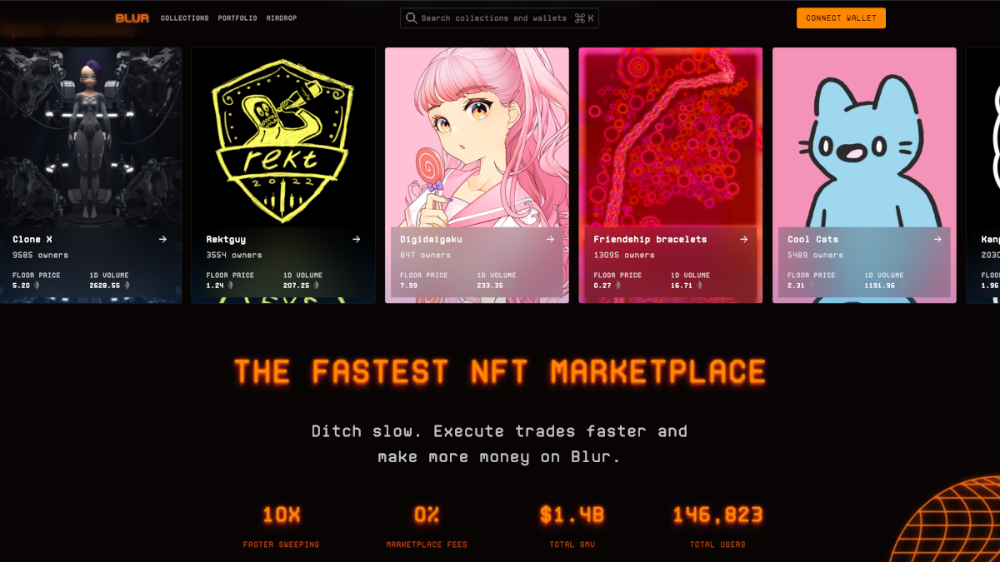
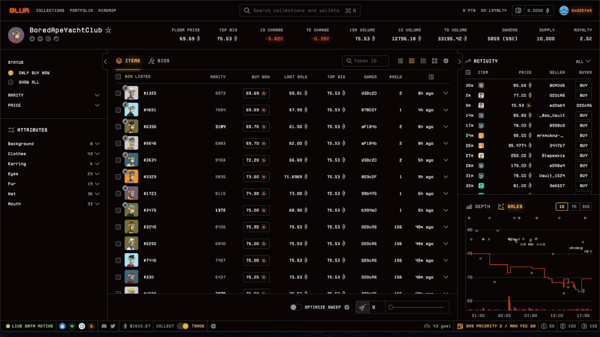

# How Blur is Causing Waves at OpenSea

<!-- Proposed meta description -->
<!-- An overview of the Blur NFT marketplace and its recent success -->

## What is Blur?

[Blur](https://blur.io/) is a hybrid marketplace/aggregator for collecting and trading non-fungible tokens (NFTs).
It launched in October 2022, receiving support from [Paradigm](https://www.paradigm.xyz/), among others, and has shown enormous growth to date.

The Ethereum-based platform brands itself as "the NFT marketplace for pro traders" and features sophisticated real-time analytics and portfolio management tools.
In addition, Blur lets users compare NFTs across multiple platforms and claims to offer users faster NFT sweeps and swipes compared to its competitors.

## BLUR Token Launch

On 14 February 2023, Blur officially [released its native token](https://twitter.com/blur_io/status/1625566146241114112), BLUR, making 360 million BLUR tokens available to active traders, "care package" holders and creators.
This was the third in a series of airdrops that Blur distributed to traders who bought Ethereum-based NFTs on the platform since its launch.

BLUR serves as a governance token, meaning that token holders can vote on changes made to the protocol, strengthening Blur's decentralization by giving authority to the community.
Those who contribute towards the protocol's success are rewarded with extra tokens, which Blur states comes with being loyal and only listing collections on its platform.

## What Makes Blur Special?

Blur's place in the NFT trading world is marked by its zero marketplace fees, specialized tracking capabilities, and incentive strategies in the form of BLUR tokens, which can be earned as rewards for paying royalties.
These features deliberately target professional traders, whom Blur's founder, Pacman (who recently [doxxed himself](https://twitter.com/PacmanBlur/status/1628223367487848451)), felt needed a platform that wasn't ["slow and clunky… [and] …going down all the time."](https://youtu.be/eJg_NeXMS3o?t=210)

Users can monitor analytics and manage their portfolio from either a collector's or a trader's perspective using Blur's slick user interface.
This view is tailored for each type of user and is switchable via the bottom status bar.

## Royalties on Blur vs. OpenSea

In November 2022, OpenSea launched a tool for on-chain enforcement of royalties, called the Operator Filter Registry.
OpenSea would enforce royalties for any collection that implemented such a tool, and blocked other platforms that did not do the same (such as Blur at the time), preventing creators from earning royalties on both.
Royalties were not enforced for collections that opted not to use the filter.

After finding a loophole related to Blur integrating the Seaport protocol  – founded by OpenSea – Blur retaliated by allowing all collections to be listed/traded _and_ enforcing royalties in full, [as long as the collection blocked OpenSea](https://mirror.xyz/blurdao.eth/vYOjzk4cQCQ7AtuJWWiZPoNZ04YKQmTMsos0NNq_hYs).

Blur took it a step further and called on OpenSea to remove them from the blocklist, so that creators could earn full royalties on both platforms, instead of OpenSea's optional creator earnings when a collection is traded on Blur.

[OpenSea responded](https://twitter.com/opensea/status/1626682043655507969) by offering zero fees for a limited time and optional creator earnings of at least 0.5% for all collections that did not use the filter.
Furthermore, OpenSea removed marketplaces that did not have the same policy (including Blur) from their blocklist.
As a result, creators can at this point earn royalties on both Blur and OpenSea, with only Blur honouring full royalties to creators in all cases.

## Conclusion

Blur's advanced features, recent token launch and progressive royalty policy have triggered widespread intrigue and competition in the space, and platforms such as OpenSea are feeling the pressure to up their game.

At the end of the day, however, this push is constructive, as creators benefit from enforced royalties, and traders and collectors are rewarded for being active, which fuels much-needed growth in the NFT space.

#### Useful Links

- Read [The Ultimate Guide to NFT Royalties and NFT Marketplaces in 2023](<https://coinmarketcap.com/alexandria/article/the-ultimate-guide-to-nft-royalties-and-nft-marketplaces>)
- Learn more with this in-depth explanation of [how Blur bypassed OpenSea's blocklist](https://twitter.com/pandajackson42/status/1620081518575235073)
- Have a look at the [BLUR token](https://etherscan.io/address/0x5283d291dbcf85356a21ba090e6db59121208b44#code), [bidding pool](https://etherscan.io/address/0x0000000000a39bb272e79075ade125fd351887ac#code) and [aggregator](https://etherscan.io/address/0x0000000000a39bb272e79075ade125fd351887ac#code) contracts on Etherscan
