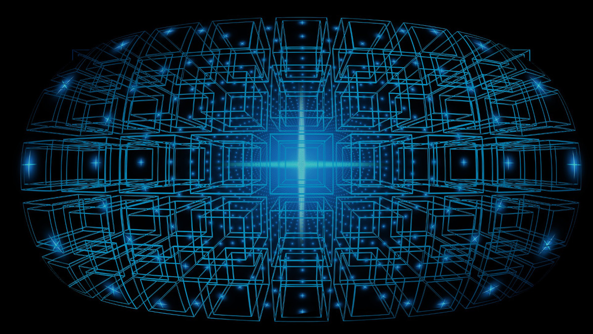

# How is Machine Learning Used with Blockchain Technology?

<!-- Proposed meta description -->
<!-- An overview of how machine learning is used with blockchain technology, including zero-knowledge rollups such as StarkNet. -->

<!-- image -->

## Contents

- [What is Machine Learning?](#what-is-machine-learning)
- [Machine Learning Applications in Blockchain Technology](#machine-learning-applications-in-blockchain-technology)
- [How is Zero-Knowledge Linked with Machine Learning?](#how-is-zero-knowledge-linked-with-machine-learning)
  - [What is a Zero-Knowledge Proof?](#what-is-a-zero-knowledge-proof)
  - [Zero-Knowledge Machine Learning](#zero-knowledge-machine-learning)
  - [Machine Learning on StarkNet with Giza](#machine-learning-on-starknet-with-giza)
- [Final Notes](#final-notes)
  - [Useful Links](#useful-links)

## What is Machine Learning?

[(Supervised)](#useful-links) Machine learning (ML) systems learn how to combine input data (examples) to make useful predictions on previously unseen data.

**Labelled examples** are used to train ML models, which infer or predict the label of new **unlabelled examples** based on their features, by applying this training data.

ML systems allow developers to:

- reduce programming time, by utilizing an existing ML model and feeding it new data, resulting in a more reliable program, much more quickly;
- customize and scale products, by training a single ML model that can be reused for specific applications, simply by inputting different unlabelled examples;
- solve problems that can be expressed naturally but seem manually unprogrammable.

## Machine Learning Applications in Blockchain Technology

ML models can be trained using on-chain data and then utilized to analyse new data to make predictions or for pure analysis purposes.
This information can then be read on chain by users, dApps, NFTs, DAOs or any smart contract with permissions.

One of the benefits of using on-chain information is that it is reliable, as blockchain data is verifiable, immutable and non-destructive.

ML and blockchain technology can be combined to form a robust architecture, where ML is used for data analytics and blockchain technology provides data storage and distribution mechanisms.

Constructive applications of ML models within blockchain protocols include:

- Testing and improving protocol security and data verification procedures
- Detecting malicious attacks or illicit transactions
- Reducing the time to find the golden nonce

## How is Zero-Knowledge Linked with Machine Learning?

### What is a Zero-Knowledge Proof?

In the field of cryptography, a zero-knowledge proof (ZKP) or protocol is a way for one party (the **prover**) to demonstrate to a second party (the **verifier**) that some secret information is true, without disclosing the information itself.

### Zero-Knowledge Machine Learning

Zero-knowledge machine learning (ZKML) is considered the most nascent application of blockchain/ledger technology.

ZKPs have been known to help reduce blockchain computation stress by securely performing off-chain calculations, which are then verified on chain, much more cheaply, using ZK rollups.

Applying these methods provides an effective way to implement private, on-chain ML, allowing for scalable treatment of shielded data for various use cases.

One such use case could be a dApp that uses ML to calculate a user's credit score based on personal data such as their date of birth, monthly income and expenses.
A user could rent an expensive apartment with their credit score without divulging any sensitive information.

Using a [zk-SNARK](https://consensys.net/blog/developers/introduction-to-zk-snarks/), it would be possible for the user to produce verifiable proof that their credit score has not been fabricated, by inputting their personal (private) details and supposed (public) credit score.

### Machine Learning on StarkNet with Giza

[Giza](https://mirror.xyz/gizatech.eth) is a decentralized, fully-on-chain ML platform built on [StarkNet](https://starkware.co/starknet/) (an Ethereum layer-2 network) that is geared towards deployment scaling and tackling current issues faced by ML models in cloud-based web2 systems.

ML models deployed with Giza leverage StarkNet's ZK-rollup architecture and load-handling capabilities, which offer 0% downtime, fault tolerance, high performance and fast deployment speeds.

Blockchains like StarkNet simplify the process of monitoring usage and performance for ML models, as this data is stored natively on the chain.

The integration of ML and blockchain networks such as StarkNet allows for numerous use cases, including:

- AI-powered smart contracts
- ML inference on Ethereum Layer 1
- Delivering inferences to web2 systems with an oracle

## Final Notes

The intersection of machine learning and blockchain technology provides an exciting new environment for developers and researchers to explore.
Innovations from both fields bring together the strengths of ML and Web3, and offers solutions for numerous problems in all spheres.

#### Useful Links

- Google Developer's [Machine Learning Crash Course](https://developers.google.com/machine-learning/crash-course/ml-intro)
- [Supervised vs. unsupervised learning](https://www.ibm.com/cloud/blog/supervised-vs-unsupervised-learning) explained
- Tutorial and demo of [ZKML with the MNIST dataset](https://0xparc.org/blog/zk-mnist)
