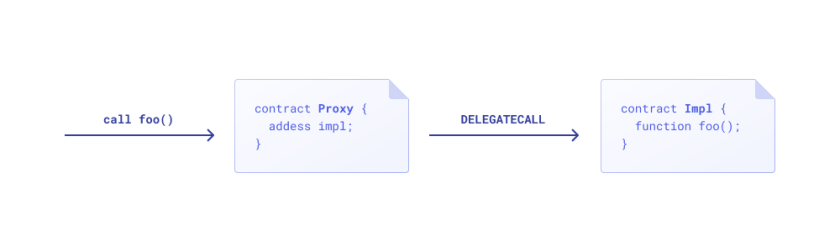

# Pros and Cons of Upgrading Smart Contracts

<!-- Proposed Meta description -->
<!-- Introduction to upgradeable smart contracts and their pros and cons -->

## What is an Upgradeable Smart Contract?

### Are Smart Contracts Really Immutable?

> | Pros | Cons |
>| :---: | :---: |
> | ✅ Secure | ❌ Limited functionality |
> | ✅ Decentralized | ❌ Unable to fix bugs in original code |

Solidity smart contracts and the Ethereum Virtual Machine (EVM) are, by nature, immutable, which helps to ensure the protocol's security, trustlessness and decentralization.

However, there are instances when a developer may decide to upgrade a smart contract (note that **upgradeable** is not the same as **mutable**).
This is typically achieved through the use of a **proxy upgrade pattern**, which gives smart contracts some level of flexibility when it comes to making changes to its functionality.

### Proxy Pattern Components

Smart contracts can be made upgradeable by leveraging a design pattern that consists of two components: (1) a proxy contract, and (2) an implementation or logic contract.

In short, the user interacts with the proxy contract (contract A), which contains the storage and balance data.
Meanwhile, the implementation contract (contract B) contains the logic to be executed.
This execution happens in the context of contract A via a delegate call.

>Image Credit: [OpenZeppelin blog](https://blog.openzeppelin.com/)

The proxy contract itself cannot be modified; however, it can redirect messages from `msg.sender` to a new implementation contract with updated logic, which may provide additional functionality and bug fixes.

## Why Should You Upgrade a Smart Contract?

> | Pros | Cons |
> | :---: | :---: |
> | ✅ Solve vulnerabilities discovered after deployment | ❌ Potential for malicious exploits |
> | ✅ Add functionality and improve UX | ❌ Decreased decentralization and trustlessness |

Upgrading smart contracts allows developers to add features and enhancements to a dApp in order to improve user experience and performance.
Leveraging a proxy pattern also makes fixing bugs discovered after deployment easier, as proxy contracts can simply point to a new logic contract once the issue is resolved.

At the same time, violating smart contract immutability leads to potential security risks, and reduced decentralization and trustlessness.
This could be considered a major drawback as it contradicts core features, and so it is a good idea to take this into account.

## How to Upgrade a Smart Contract with `DELEGATECALL`

Proxy patterns operate by utilizing the opcode `DELEGATECALL` to [dynamically access logic](https://docs.soliditylang.org/en/v0.8.19/introduction-to-smart-contracts.html#delegatecall-and-libraries) in an implementation contract from a proxy contract at runtime.

In order to upgrade a smart contract, the developer writes a new implementation contract with the desired changes and then updates the reference address in the proxy contract with a function like `upgradeTo(address newImplementation)`.
This allows the proxy contract to access the updated logic in the implementation contract, making it upgradeable.

There are two popular implementations of the proxy pattern when developing smart contracts in Solidity: (1) [transparent proxy pattern](https://blog.openzeppelin.com/the-state-of-smart-contract-upgrades/#transparent-proxies) and (2) [universal upgradeable proxy standard](https://blog.openzeppelin.com/the-state-of-smart-contract-upgrades/#universal-upgradeable-proxies) or UUPS.

### Transparent Proxy Pattern

 >| Pros | Cons |
>| :---: | :---: |
>| ✅ Fairly straightforward to implement | ❌ Expensive to deploy |
>| ✅ Easy to maintain | ❌ Requires a lot of storage |

The **transparent proxy pattern** ([developed by OpenZeppelin](https://blog.openzeppelin.com/the-transparent-proxy-pattern/)) is the more established approach when writing upgradeable smart contracts.

Its biggest selling point is its ability to solve the [function selector clash](https://medium.com/nomic-foundation-blog/malicious-backdoors-in-ethereum-proxies-62629adf3357), which can sometimes make it difficult for the Solidity compiler to distinguish function calls from the two different contracts.

The transparent proxy pattern provides a solution to this problem by tracking `msg.sender` (i.e., the calling address).
If `msg.sender` points to an external address, the compiler executes the logic in the implementation contract.
However, if an upgrade management function is called from an admin address (confirmed with the `onlyAdmin` modifier), the compiler performs the requested operation in the proxy contract.

This rather elegant solution has one major downside: gas cost.
The EVM loads the proxy contract on each call in order to execute the logic in the implementation contract, which takes up a significant amount of storage.

### Universal Upgradeable Proxy Standard (UUPS)

> | Pros | Cons |
> | :---: | :---: |
> | ✅ Cheaper to deploy | ❌ Riskier implementation |
> | ✅ Requires less storage | ❌ More complicated to maintain |

**UUPS** was also proposed by OpenZeppelin as a less common alternative to the transparent proxy pattern and uses a similar delegate call procedure.

In this standard, the upgrade logic is **stored in the implementation contract** instead of the proxy itself.

As the proxy uses delegate calls, the implementation contract always writes to the proxy contract.
Furthermore, recall that the implementation contract address is also stored in the proxy contract's storage.
Therefore, the logic contract is technically free to contain the upgrade management functionality.

UUPS leverages this concept by making all implementation contracts extend some base `Proxiable` contract.

Benefits of this include making it easier for the Solidity compiler to check for function selector clashes, as the main functions are all in the same contract.
In addition, UUPS proxy contracts have a smaller footprint than their transparent proxy counterparts, which makes deployment easier and cheaper.

One major disadvantage with UUPS is that it is impossible to upgrade a proxy contract to an implementation that does not implement the `Proxiable` contract.
This may have the undesirable result of a proxy being fixed to a single implementation, making future changes impossible (i.e., rendering the contract un-upgradeable).
As a result, many developers prefer to keep their upgradeable logic immutable; thus, in the proxy contract.

## Final Thoughts

Both the transparent proxy pattern and UUPS are great ways to make smart contracts upgradeable, allowing developers to fix bugs and add functionality post-deployment.
While upgrading smart contract somewhat contradicts traditional blockchain philosophy, many would consider the benefits to outweigh the drawbacks.

Be sure to check out the links below to learn more!

#### Useful Links

- [Introduction to Upgradeable Smart Contracts](https://www.quicknode.com/guides/ethereum-development/smart-contracts/an-introduction-to-upgradeable-smart-contracts/) guide by QuickNode

- [Proxy Upgrade Pattern](https://docs.openzeppelin.com/upgrades-plugins/1.x/proxies) from OpenZeppelin docs

- [Upgrading Smart Contracts](https://docs.openzeppelin.com/learn/upgrading-smart-contracts) tutorial by OpenZeppelin
- [Writing Upgradeable Contracts](https://docs.openzeppelin.com/upgrades-plugins/1.x/writing-upgradeable) tutorial by OpenZeppelin

#### More Advanced Reading

- [ERC-1822: Universal Upgradeable Proxy Standard (UUPS)]((<https://eips.ethereum.org/EIPS/eip-1822>)) from Ethereum Improvement Proposals (EIPs)
- [ERC-2535: Diamonds, Multi-Facet Proxy](https://eips.ethereum.org/EIPS/eip-2535) from EIPs
