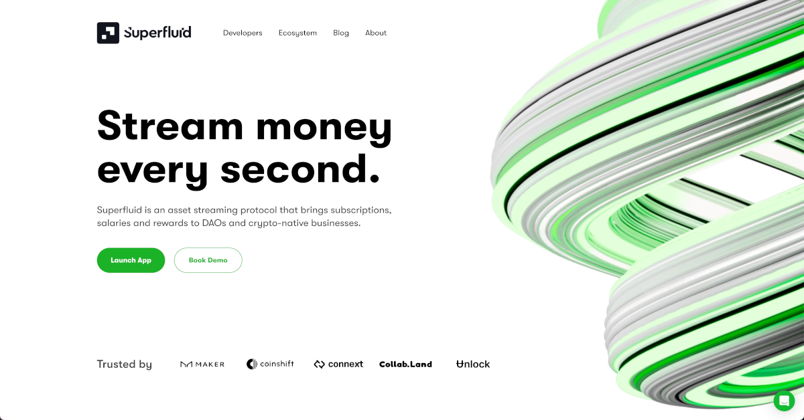

# How Superfluid Makes Payments Frictionless

<!-- Proposed Meta description -->
<!-- Overview of Superfluid, the EVM-based smart contract framework that adds new features to standard ERC-20 tokens to automate crypto payments. -->

> #### "We're on a mission to create a world where money is superfluid."
>
> -_Superfluid_

## What is Superfluid?

The [Superfluid Protocol](https://www.superfluid.finance/) is an EVM-based smart contract framework that allows for streaming crypto payments.  

Using predefined rules called [agreements](https://docs.superfluid.finance/superfluid/protocol-overview/in-depth-overview/super-agreements), Superfluid provides a new way to automate ongoing token transactions.
All it takes is a single on-chain transaction, and money will flow from your wallet to the receiver(s) in real time with **no capital lock-up** or recurring gas fees!

## Superfluid Use Cases

Superfluid lets you seamlessly make continuous payments without requiring additional interaction.

- Salaries can be paid out in streams, meaning that employees get paid by the second and don't have to wait for their monthly pay check.

- Payments for digital media, news and software subscriptions can be automated to constantly stream, allowing users to update or stop payments instantaneously.

- Rewards and royalties can be distributed to multiple recipients in a single transaction with a fixed gas cost.

- Agreements can automatically add money to a savings, pension or investment account to ensure money is being put away at a constant rate.  

These are just some of the many possible solutions that Superfluid offers in DeFi and the broader Web3 space.

## Superfluid Components

The Superfluid Protocol consists of four main components:

- **Super Tokens**: extend [standard ERC-20](https://ethereum.org/en/developers/docs/standards/tokens/erc-20/) functionality
- **Super Agreements**: give Super Tokens money streaming capabilities
- **Super Apps**: smart contracts that respond to Super Agreements
- **Super Host**: the brain of the operation

### Super Tokens

> Superfluid created Super Tokens to build on standard ERC-20 tokens' on-chain transfer paradigm.

There are two types of [Super Token](https://docs.superfluid.finance/superfluid/protocol-overview/in-depth-overview/super-tokens): **wrappers** and **custom tokens**.

Wrapped tokens are existing tokens that have been wrapped into a Super Token so that they can inherit Super Token functionality.

Custom tokens don't need to be wrapped or unwrapped as they are already Super Tokens and have all the available functionalities that Super Agreements provide.

### Super Agreements

> Super Agreements define the additional functionalities that Super Tokens possess over ERC-20s.

There are two Super Agreements that each serve their own purpose: Constant Flow Agreements (CFAs) and Instant Distribution Agreements (IDAs).

#### P2P Token Streaming

CFAs let you to constantly transfer tokens between two accounts. 

The sender agrees to have its balance reduced by some amount at some by-the-second value (called the _flow rate_) and the receiver has its account balance increased at the same rate.

#### Recurring One-to-Many Payments

IDAs permit a single sending account to distribute tokens to multiple receiving accounts by setting proportions.

When a lump sum payment is made, each recipient receives its share in one transaction with a fixed gas cost.

### Super Apps

> Super Apps are registered with the Superfluid Protocol so that they can react to Super Agreements.

These apps use callbacks with custom logic to create, update and delete Super Agreements.
They can be programmed to do things like mint NFTs or create new agreements in real time.

[Super Apps](https://docs.superfluid.finance/superfluid/protocol-overview/in-depth-overview/super-apps) provide extra programmability to create more complex, scalable dApps that extend Super Agreement functionality.

### Super Host

> The Superfluid Host sits at the centre of the Superfluid Protocol and connects Super Tokens, Super Agreements and Super Apps.

The [Superfluid Host](https://docs.superfluid.finance/superfluid/protocol-overview/in-depth-overview/superfluid-host) contract provides Super Tokens (the base of the protocol) with information about the Super Agreements.
It also contains the registered Super Apps and allows for their callback logic to be activated.

## Conclusion

Superfluid is a powerful framework that adds new features to standard ERC-20 token functionality.
It allows for automated money streaming and instant one-to-many token distributions with minimal gas costs and no capital lock-up.

#### Useful Links

- [Read the docs](https://docs.superfluid.finance/superfluid/)
- Visit Superfluid's [GitHub](https://github.com/superfluid-finance/protocol-monorepo)
- Check out the [Superfluid Dashboard](https://app.superfluid.finance/)