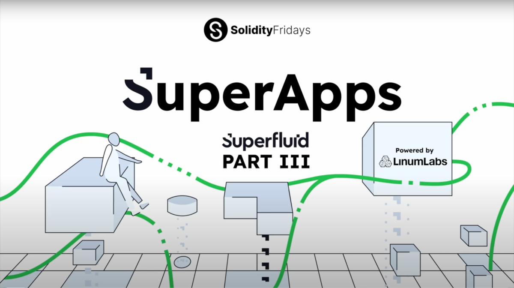

# Introduction to Super Apps (Superfluid)

<!-- Proposed meta description -->
<!-- Overview of how Super Apps work in Superfluid with Solidity code examples. -->



> #### [Superfluid](https://www.superfluid.finance/) is an EVM-based smart contract framework that allows for token streaming and recurring lump sum distributions

## What is a Super App?

[Super Apps](https://docs.superfluid.finance/superfluid/developers/super-apps) are smart contracts that use callback functions to respond (or "react") to related [Super Agreements](https://docs.superfluid.finance/superfluid/protocol-overview/in-depth-overview/super-agreements) being created, updated or deleted.

These callbacks are executed entirely on chain and may contain any arbitrary logic, provided it conforms to smart contract development and Super App rules.

Callbacks can be used to mint NFTs, create new agreements or do practically anything else.

## Why Use Super Apps?  

Super Apps act as intermediaries between Super Agreements and increase the interaction possibilities between accounts by adding extra programmability, making dApps more scalable.

An example of a Super App could be a digital media provider (e.g., music, podcasts, videos, online news and articles) that receives user subscription streams on a pay-as-you-consume basis and then automatically redistributes a portion of the incoming tokens to each of the royalty-holders or content creators when a stream stops.

Another use case could be an automated lending service, where a Super App coordinates outgoing token distributions and incoming repayment streams.

Stream-to-stream and distribution-to-distribution agreement redirections are also possible with Super Apps.

## How Do Super Apps Work?

### Protocol Registration

Callbacks in Super App smart contracts contain custom code, which must be implemented on deployment for the contract to be correctly identified.

In addition, Super Apps must be "registered" with the protocol in the Superfluid Host contract, which contains a mapping with all Super App addresses.

If the Super App's address is found in the mapping, the protocol will activate its callbacks and the Super App will be able to react to Super Agreements.

### Callbacks

Callbacks act as hooks and are called by the protocol on chain in response to events, such as when a Super App contract interacts with logic executed in an existing Super Agreement.

There are currently two types of Super Agreement that have been released: constant flow agreements (CFAs) and instant distribution agreements (IDAs).

With CFAs, logic that may trigger a callback execution includes:

- a stream being **created** where the Super App is the `receiver`
- a stream being **updated** where the Super App is the `receiver`
- a stream being **deleted** by an external user or contract (either the stream's sender or receiver)

Similar principles can be applied to IDAs, where a callback is triggered when an index is created, updated or deleted.

### Technical Description

All six callbacks are defined in the [ISuperApp interface](https://github.com/superfluid-finance/protocol-monorepo/blob/dev/packages/ethereum-contracts/contracts/interfaces/superfluid/ISuperApp.sol) and are forwarded to Super Apps by default.

Super Apps can inherit the [SuperAppBase abstract contract](https://github.com/superfluid-finance/protocol-monorepo/blob/dev/packages/ethereum-contracts/contracts/apps/SuperAppBase.sol), which contains default callback implementations that revert by default.

Developers must define their own implementations in the constructor to replace these or mark the unused callbacks with `_NOOP` ("no-op").

The Super App must then be registered with the protocol, using its `configWord` and a specified registration key.

### Solidity Code Examples

#### Super App Constructor

```typescript
// must be included in a Super App's constructor
// `APP_LEVEL_FINAL` refers to the number of callbacks that will run 
// in a hypothetical chain of Super Apps
uint256 configWord =
            SuperAppDefinitions.APP_LEVEL_FINAL |
            SuperAppDefinitions.BEFORE_AGREEMENT_CREATED_NOOP |
            SuperAppDefinitions.BEFORE_AGREEMENT_UPDATED_NOOP |
            SuperAppDefinitions.BEFORE_AGREEMENT_TERMINATED_NOOP;

// can be an empty string in dev or testnet deployments
string memory registrationKey = "";

// register Super App with the host contract's Super App manifest
_host.registerAppWithKey(configWord, registrationKey);
```

#### Callbacks (from the ISuperApp interface in Superfluid's GitHub repo)

```typescript
    // callback BEFORE a new agreement is CREATED
    // can only revert with a given reason
    function beforeAgreementCreated(
        ISuperToken superToken, //  Super Token used for the agreement
        address agreementClass,
        bytes32 agreementId, 
        bytes calldata agreementData, // agreement data (non-compressed)
        bytes calldata ctx // context data
    )
        external
        view // state change not permitted
        // data used to pass arbitrary info to after-hook callback
        returns (bytes memory cbdata);
```

```javascript
    // callback AFTER a new agreement is CREATED
    // can only revert with a given reason
    function afterAgreementCreated(
        ISuperToken superToken,
        address agreementClass,
        bytes32 agreementId,
        bytes calldata agreementData,
        bytes calldata cbdata, // data returned from before-hook callback
        bytes calldata ctx
    )
        external
        // (state change permitted)
        returns (bytes memory newCtx); // current context of the transaction
```

```javascript
    // callback BEFORE an agreement is UPDATED
    // can only revert with a given reason
    function beforeAgreementUpdated(
        ISuperToken superToken,
        address agreementClass,
        bytes32 agreementId,
        bytes calldata agreementData,
        bytes calldata ctx
    )
        external
        view // state change not permitted
        // data used to pass arbitrary info to after-hook callback
        returns (bytes memory cbdata);
```

```javascript
    // callback AFTER an agreement is TERMINATED
    // revert not permitted
  function afterAgreementTerminated(
        ISuperToken superToken,
        address agreementClass,
        bytes32 agreementId,
        bytes calldata agreementData,
        bytes calldata cbdata, // data returned from before-hook callback
        bytes calldata ctx
    )
        external
        // (state change permitted)
        returns (bytes memory newCtx); // current context of the transaction
```

## Conclusion

Super Apps allow programmable interaction between Super Agreements and integration with the Superfluid protocol.

They support custom callback logic that can be used to execute a number of activities that would otherwise not be possible and in doing so, Super Apps make it possible to build full-featured, scalable dApps.

#### Useful Links

- Read the Superfluid [docs](https://docs.superfluid.finance/superfluid/)
- Visit Superfluid's [GitHub](https://github.com/superfluid-finance/protocol-monorepo)
- Check out the [Superfluid Dashboard](https://app.superfluid.finance/)

<!-- TODO: add URL to Solidity Fridays earlier article 'How Superfluid Makes Payments Frictionless' -->

<!-- TODO: add URL to Solidity Fridays earlier article 'What are Superfluid Agreements?' -->
