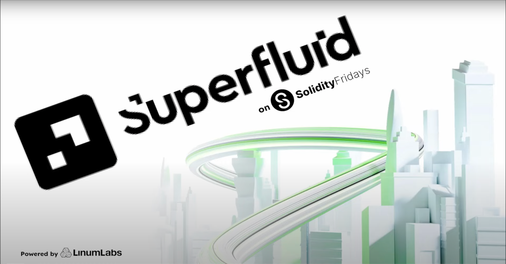
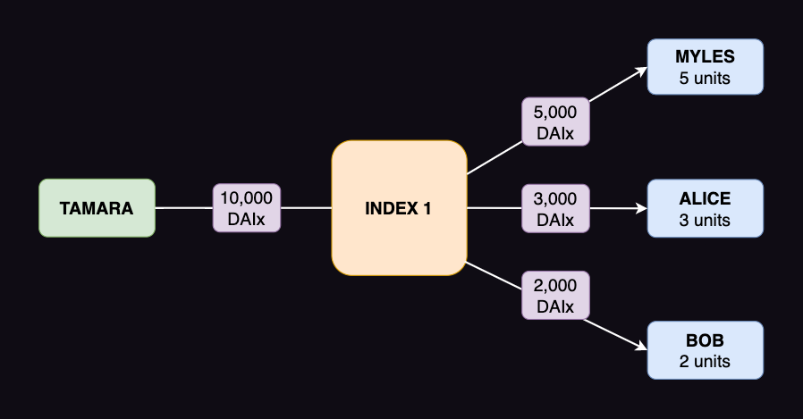

# What are Superfluid Agreements?

<!-- Proposed meta description -->
<!-- Overview of Superfluid's Super Agreements, which add money streaming and recurring payment distribution abilities to standard ERC-20 tokens. -->



> #### [Superfluid](https://www.superfluid.finance/) is an EVM-based smart contract framework that allows for token streaming and recurring lump sum distributions  
>
> It utilizes [Super Agreements](https://docs.superfluid.finance/superfluid/protocol-overview/in-depth-overview/super-agreements) to extend standard ERC-20 token functionality and uses [Super Tokens](https://docs.superfluid.finance/superfluid/protocol-overview/in-depth-overview/super-tokens) to automate crypto payments.
>

## How Do Super Agreements Work?

In a Super Agreement, an account agrees to have its Super Token balance modified, according to a set of predefined rules and chosen parameters.  

### Types of Super Agreement

At present, there are two available Super Agreements: the [Constant Flow Agreement](https://docs.superfluid.finance/superfluid/developers/constant-flow-agreement-cfa) (CFA) and the [Instant Distribution Agreement](https://docs.superfluid.finance/superfluid/developers/instant-distribution-agreement-ida) (IDA).  

CFAs let you continuously move tokens from one account to another at a per-second rate (called the _flow rate_).

IDAs help to scale recurring one-to-many payment distributions.  

Superfluid are currently developing a third agreement, the Flow Distribution Agreement (FDA), which will allow for one-to-many streaming distribution functionality.

### Digital Asset Streaming

#### Flow Mechanics

CFAs let you open streams to move tokens between two accounts via an ongoing flow of transactions.
Once created, a stream will continue to run until the sender's account balance reaches zero or the stream is stopped.
CFAs can also have their flow parameters updated at any point.

When the sender creates, updates or deletes (CRUD) a stream, the following information is handled in the CFA smart contract code:

1. Net `flowRate` – sum of incoming and outgoing flow rates
2. CRUD `timeStamp` – UTC timestamp at the time of change
3. Static balance – Super Token balance at the latest `timeStamp`
4. `realTimeBalance` – difference in balance from previous to current CRUD `timeStamp`; can be positive or negative

To update the real-time balance, the CFA multiplies the net flow rate by the number of seconds elapsed since the latest CRUD timestamp.

> RTB = (amount moving in and out / second) * (seconds elapsed since last timestamp)

<!-- Since the net flow rate is fixed once it has been set or adjusted, multiplying this per-second rate by some number of seconds yields the real-time balance. -->

This doesn't require gas, because the real-time balance is automatically modified by passing time.

#### Solidity Code Examples (from the [CFA smart contract code](https://github.com/superfluid-finance/protocol-monorepo/blob/dev/packages/ethereum-contracts/contracts/agreements/ConstantFlowAgreementV1.sol) in Superfluid's GitHub repo)

```swift
    // flow variables
    struct _StackVars_createOrUpdateFlow {
        ISuperfluidToken token; // Super Token address
        address sender;
        address receiver;
        int96 flowRate; // new flow rate in amount per second (pos. or neg.)
    }

    // flow data
    struct FlowData {
        uint256 timestamp; 
        int96 flowRate;
        uint256 deposit; // amount Superfluid takes when opening a stream
        uint256 owedDeposit; // amount a Super App can draw to open a stream
    }
```

```javascript
    // update an existing stream
    function updateFlow(
        ISuperfluidToken token,
        address receiver,
        int96 flowRate,
        bytes calldata ctx // context
    )
        external
        override
        returns(bytes memory newCtx)
    {
        // capture current context (contains timestamp and sender address)
        ISuperfluid.Context memory currentContext 
        = AgreementLibrary.authorizeTokenAccess(token, ctx);

        // set flow variables for updated stream
        _StackVars_createOrUpdateFlow memory flowVars;
        flowVars.token = token; 
        flowVars.sender = currentContext.msgSender;
        flowVars.receiver = receiver;
        flowVars.flowRate = flowRate; 

        // generate a new flowId (keccak256 hash of encoded sender 
        // and receiver addresses)
        bytes32 flowId = _generateFlowId(flowVars.sender, flowVars.receiver);
        // get the data of the stream to be updated and confirm it exists
        (bool exist, FlowData memory oldFlowData) 
        = _getAgreementData(flowVars.token, flowId);

        // update stream and return new context using internal helper function
        newCtx = _updateFlow(
            flowVars,
            oldFlowData,
            exist,
            ctx,
            currentContext
        );
    }
```

### Recurring Payment Distributions with IDAs



IDAs let **publishers** (senders) distribute digital assets to multiple **subscribers** (receiving accounts) in a single transaction, with a fixed gas cost.

The publisher creates an IDA index, which acts as a channel through which Super Tokens are proportionally distributed.

Then, the publisher assigns each subscriber a portion of the tokens, in units.
The more units a subscriber owns, the larger their share of the distributed tokens will be.

When the publisher triggers the distribution, all the subscribers will instantly, simultaneously receive their share of tokens, without the need for multiple transactions (which cost gas).

Subscribers' units persist between distributions –  i.e., the agreement does not reset.
This makes it possible to have continual distributions with varying proportions.
As with flow parameters in CFAs, the number of units can be changed as and when the publisher wishes.

## Super Agreement Use Cases

Super Agreements are flexible and modular and help optimize many processes.

Some of these include:

- Constant salary and allowance streams
- Pay-on-consumption digital media (e.g., audio, video and news) and software subscriptions
- Automated DAO payroll management
- DeFi borrowing and lending
- Savings and investment contributions to multiple accounts
- Royalties and rewards distributions
- Web3 start-ups and project sponsorship

## Conclusion

Superfluid uses Super Agreements to make ongoing token streaming and recurring one-to-many distributions possible, by extending standard ERC-20 token functionality with Super Tokens.

Super Agreements are extensible and provide scalable solutions to numerous problems, many of which are yet to be discovered.

#### Useful Links

- Read the Superfluid [docs](https://docs.superfluid.finance/superfluid/)
- Visit Superfluid's [GitHub](https://github.com/superfluid-finance/protocol-monorepo)
- Check out the [Superfluid Dashboard](https://app.superfluid.finance/)

<!-- TODO: add URL to Solidity Fridays earlier article 'How Superfluid Makes Payments Frictionless' -->