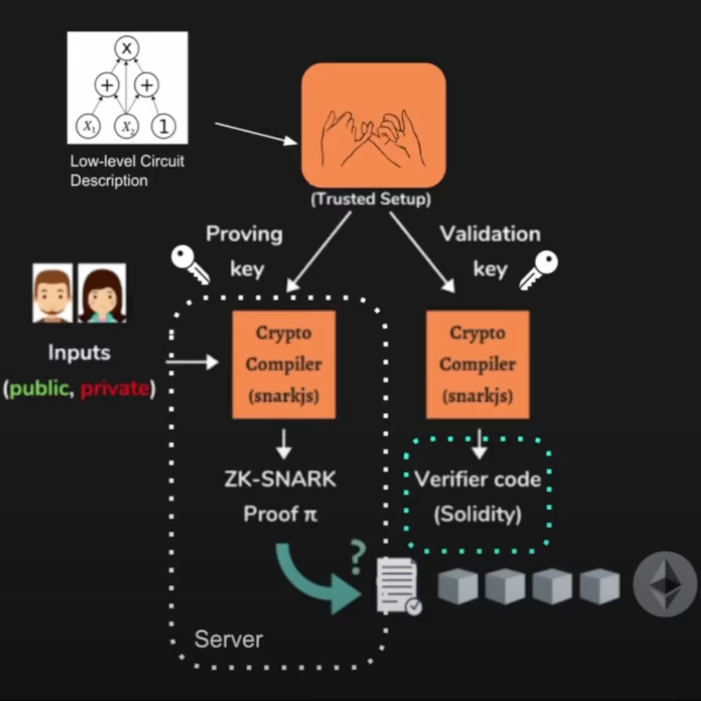

# How to Architect Zero-Knowledge Blockchain Apps

> A description of the basic components of a ZK App.

## Overview of Zero-Knowledge Applications

Zero-knowledge applications (ZK apps) are a combination of an off-chain and on-chain application.
The **zero-knowledge proof** (ZKP) is typically executed off-chain and then submitted to an on-chain **verifier**.

## Components of a Zero-Knowledge App

### 1. Arithmetic Circuit Description

The first component in the architecture of a ZK app involves setting up an arithmetic circuit.
This is a representation of the real-world constraints that are needed in trying to prove the validity of a given statement.

[Circom](https://github.com/iden3/circom) is used to specify arithmetic circuits in a high-level language, which can then be compiled down to binary code and sent to the setup phase.
It is also possible to have inner/nested circuits and circuit "arrays".

A drawback with arithmetic circuits is that one can never be entirely certain that they enforce all real-world constraints.

### 2. Trusted Setup Ceremony

This is a procedure that is done once, to generate a piece of data using secret information.

The data must then be used every time some cryptographic protocol is run and is needed in the Groth16 system, for example.

A **proving key** and **validation key** are generated from this ceremony.

### 3. Proof Generation

The proving key is used to call a proof generation algorithm, such as Groth16.

[snarkjs](https://github.com/iden3/snarkjs) is a useful JavaScript implementation that takes public (**statement**) and private (**witness**) inputs to generate a ZK proof (ZK-SNARK).

This process proves that the **prover** knows what they know and typically runs on an off-chain (centralized) server.

Unfortunately, generating proofs in this way is known to be very computationally expensive and requires a lot memory.

The ZK proof is then sent to an on-chain verifier contract (written in Solidity when run on the EVM).

### 4. Verification

This typically takes the form of an on-chain smart contract, often executed on the Ethereum Virtual Machine (EVM).

The verifier contract requires a **common reference string** (CRS) which is used to ensure trust between themselves and the prover.

## Summary

ZK blockchain apps consist of an arithmetic circuit, a trusted setup ceremony, a ZK proof generated on-chain and verification that is completed off-chain.
