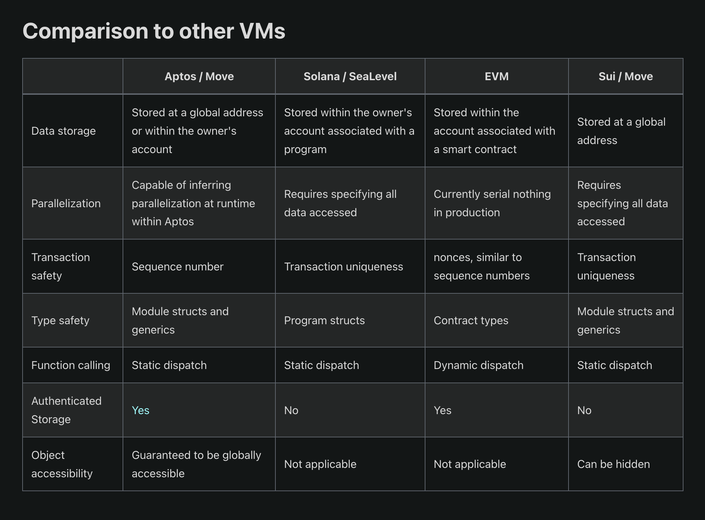
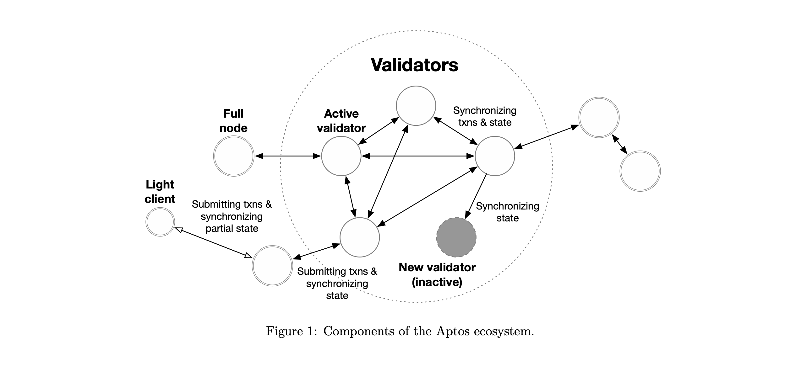

# Introduction to the Aptos Blockchain

> "Our mission is to create universal and fair access to decentralized assets for billions of people."
>
> – **Mo Shaikh**, co-founder of Aptos

## Background

The [Aptos](https://aptoslabs.com/) blockchain is a Layer 1, proof-of-stake validated blockchain that can be considered a competitor to other platforms, such as [Ethereum](https://ethereum.org/en/) and [Solana](https://solana.com/).
Aptos presents a modern approach to consensus, smart contract design, system security, performance and decentralization.

The project was founded in 2019 by former Meta employees [Mo Shaikh and Avery Ching](https://aptoslabs.com/team).
It was built by over 350 developers from across the world and its mainnet launched in October 2022.

As opposed to [Solidity](https://soliditylang.org/) (the language used to write smart contracts on the Ethereum network) the Aptos blockchain natively integrates with the [Move programming language](https://move-book.com/) for transaction execution.
Move was originally developed by engineers from Meta's [Diem blockchain](https://www.diem.com/en-us/) and is derived from Rust.

Aptos's native cryptocurrency is [APT](https://coinmarketcap.com/currencies/aptos/) (Aptos token), which had an initial total supply of one billion tokens, which are distributed between staking rewards, the Community, core contributors, the [Aptos Foundation](https://aptosfoundation.org/#about) and investors.
APT is used for transaction and network fees, governance voting on protocol upgrades and on-/off-chain processes, and securing the blockchain through staking procedures.

In the [original Aptos white paper](https://aptos.dev/assets/files/Aptos-Whitepaper-47099b4b907b432f81fc0effd34f3b6a.pdf) the authors list the project's key principles of scalability, safety, reliability and upgradeability.
These ideals are meant to address the challenges of frequent outages, high gas costs, slow transaction throughput and security vulnerabilities commonly found among contemporary blockchains.
Aptos's developers strive to encourage mass adoption of web3 technology by tackling these issues.

## What is Move?

The Aptos Network implements Move as its core underlying development component.
Move was developed with writing smart contracts in mind and originally powered the Diem blockchain.
The language is platform-agnostic, providing common libraries and tools, and engaging developer communities across different blockchains with greatly varying data and execution models.
Move aims to become the "JavaScript of web3" – i.e., to become the prevalent go-to language to quickly write robust code.

Move was designed to be a secure, verified, multipurpose language.
Aptos also implements the Move prover, which is a [formal verifier for smart contracts](https://www.certik.com/resources/blog/2wSOZ3mC55AB6CYol6Q2rP-formal-verification-the-move-language-and-the-move-prover) that provides protection for contract invariants and logic, allowing developers to guard their software from malicious entities.
Move's focus on safety and security means it has a number of scarcity and access control features that prevent resources being duplicated or dropped, or accessed by external modules (similar to smart contracts).

<!--  -->
<!-- > – image credit: **aptos.dev** -->

### Aptos Move

Aptos Move is an adapter layer that extends the core MoveVM, which operates like a computer's operating system.

The Aptos Move adapter includes features like [Move objects](https://github.com/aptos-foundation/AIPs/blob/main/aips/aip-10.md), [resource accounts](https://aptos.dev/move/move-on-aptos/resource-accounts), tables for storing key-value data, and parallelism, which allows for concurrent transaction execution.

The [Aptos Move framework](https://aptos.dev/reference/move)  comes standard with useful libraries such as the [Token standard](https://github.com/aptos-labs/aptos-core/blob/main/aptos-move/framework/aptos-token/sources/token.move), [Coin standard](https://github.com/aptos-labs/aptos-core/blob/main/aptos-move/framework/aptos-framework/sources/coin.move), a staking and delegation framework, indexing service, multisig framework and a timestamp service.

## Processing Transactions on the Aptos Network

Aptos implements a number of devices to ensure high throughput and low latency in transaction execution.

These include transaction dissemination, block metadata ordering, parallel transaction execution, batch storage and ledger certification, all of which happen concurrently.
This behaviour leverages physical resources' full capacity and optimizes hardware efficiency, helping to maintain optimum transaction processing.

### Parallel Transaction Execution

As opposed to most major blockchains that execute transactions sequentially, the Aptos blockchain's parallel execution design allows for high scalability.

Serial transaction execution requires each transaction to complete before the next is executed, which increases latency, decreases throughput and limits scalability.
In parallel execution, multiple transactions can be executed at the same time by taking a snapshot of the blockchain's current state and then executing transactions concurrently, thereby greatly increasing efficiency.

Unlike other parallel execution engines, the Aptos blockchain uses the highly efficient, multi-threaded [Block-STM](https://medium.com/aptoslabs/block-stm-how-we-execute-over-160k-transactions-per-second-on-the-aptos-blockchain-3b003657e4ba) technique to execute over well over 100,000 transactions per second, without requiring upfront knowledge of the data being handled.
It also supports atomicity[^1] to handle arbitrarily complex transactions, improving network performance and simplifying development.

## Aptos Blockchain Ecosystem

> Graphic credit: Aptos White Paper (August 2022)

### Validators and Consensus

The Aptos blockchain is made up of a number of **validators** that each receive and process transactions from users.
Aptos implements a [byzantine fault-tolerant](https://aptos.dev/reference/glossary/#byzantine-fault-tolerance-bft) (AptosBFT), proof-of-stake consensus mechanism whereby token holders stake their tokens with chosen validators, each of whose voting power is proportionate to the amount of tokens staked.
Validators are then made active and can participate in reaching consensus.

### Clients

**Clients** submit transactions and query the system's history and state. They can also download and verify validator proofs.

**Fullnodes** are clients that replicate transaction and blockchain state from validators or other fullnodes. They have the capacity to reclaim storage by pruning transaction history and blockchain state.

**Light clients** only maintain the current set of validators and can securely query partial blockchain state, usually from fullnodes. A common example is a wallet.

Clients and validators work together to manage the entire Aptos blockchain's operation.

## Scalability and Performance

In an effort to achieve high throughput and fast finality on the Aptos blockchain, the consensus protocol and transaction execution pipeline are decoupled.
This pattern involves the consensus protocol agreeing on a **proposed** transaction ordering, whilst validators execute transactions and agree upon the **final** transaction ordering and execution results on a separate protocol (as covered in previous sections).

Aptos's modular architecture permits client flexibility and optimizes for regular and rapid upgrades.
In order to swiftly deploy new technology innovations and support novel web3 use cases, Aptos offer embedded on-chain change management protocols.

A combination of this modular design and Aptos's parallel execution engine makes internal validator and homogenous state sharding, catalysing horizontal throughput sharding without additional node operator complexity.

## Summary

The Aptos blockchain is a decentralized, secure and scalable network whose novel parallel execution engine and unique architecture  allow it to achieve high throughput and low latency.

Its flavour of the robust Move programming language and its bespoke AptosBFT mechanism make it safe, secure and reliable, and place it in a strong position to rival existing blockchain paradigms such as those found in the dominant Ethereum ecosystem.

### Useful Links

- Try out some Aptos [onboarding tutorials](https://aptos.dev/tutorials)
- Read the Aptos [developer resources](https://aptosfoundation.org/developer-resources)
- Explore a few Aptos Move [examples](https://github.com/aptos-labs/aptos-core/tree/main/aptos-move/move-examples)
- Browse through some of the [projects within the Aptos ecosystem](https://github.com/aptos-foundation/ecosystem-projects)
- Have a look at the [APT tokenomics](https://aptosfoundation.org/currents/aptos-tokenomics-overview)
- Check out the [Aptos Explorer](https://explorer.aptoslabs.com/?network=mainnet)

### Notes

[^1]: Atomicity is the idea that a single transaction may contain many actions, all of which must be correct and possible for the transaction to be accepted ([Radix Learn](https://learn.radixdlt.com/article/what-is-atomic-composability)).
